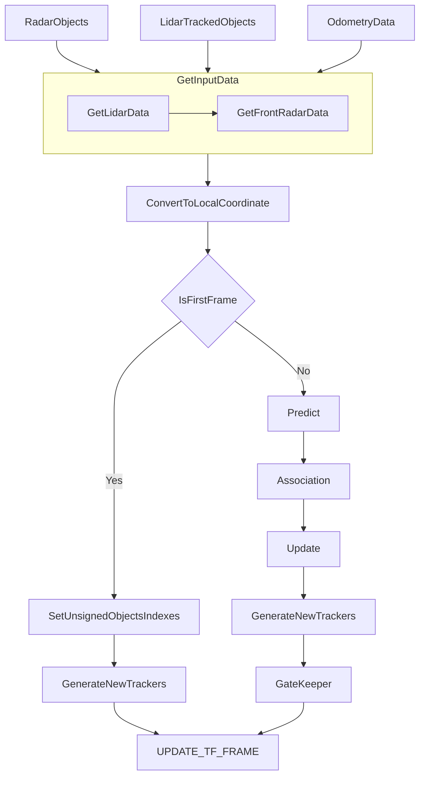

## TODO

- [x] GetInputData
- [x] GenerateNewTrackers
- [x] Predict[CV]
- [x] Association
- [x] 优化Association: 评估增加除位置外的其他维度关联
- [x] PositionVelocityUpdate
- [x] ShapeFusion
- [ ] YawUpdate
- [ ] TypeUpdate
- [x] ExistenceUpdate
- [x] GateKeeper

## 计算流程图

### `TargetFusionA`

> **说明:**
> - 匹配、跟踪均在局部坐标系下计算
> - 局部坐标系由`DR`提供 

`GetInputData`:
- 订阅雷达和激光雷达数据
- 基于激光雷达时间戳，获取前向毫米波数据
- 基于前向毫米波时间戳，获取自车车速信息
- 将毫米波数据转换到车体坐标系

`GetLidarData`:
- 获取激光雷达检测跟踪结果
- 格式转为`LidarMeasureFrame`
- 获取激光雷达时间戳对应的odometry数据（开启时间补偿）

`GetFrontRadarData`:
- 按照激光雷达时间戳获取前向毫米波雷达数据
- 格式转为`RadarMeasureFrame`
- 获取前向毫米波时间戳对应的odometry数据（开启时间补偿）
- 将毫米波数据转换到车体坐标系(相对速度转绝对速度)
- 补偿到激光雷达时间（时间+空间补偿）

`ConvertToLocalCoordinate`:
- 激光雷达数据转到局部坐标系下
- 毫米波雷达数据转到局部坐标系下

`GenerateNewTrackers`:
- 根据未分配的观测物体index生成新的Tracker

`UPDATE_TF_FRAME`
- 将Frame数据指针返回给DataManager以更新全局数据

`Association`:
- 先进行`Stable Tracker`的数据关联
- 再进行`New Tracker`的数据关联
- 再进行`Lost Tracker`的数据关联

## 代码结构

| 文件夹               | 说明                                                          |
| -------------------- | ------------------------------------------------------------- |
| `target_fusion_impl` | 目标融合任务的接口实现，应用入口实现                          |
| `data_fusion`        | Tracker定义及不同维度(位置、尺寸、类别、置信度)的融合策略实现 |
| `data_association`   | 航迹和传感器观测数据关联计算                                  |

